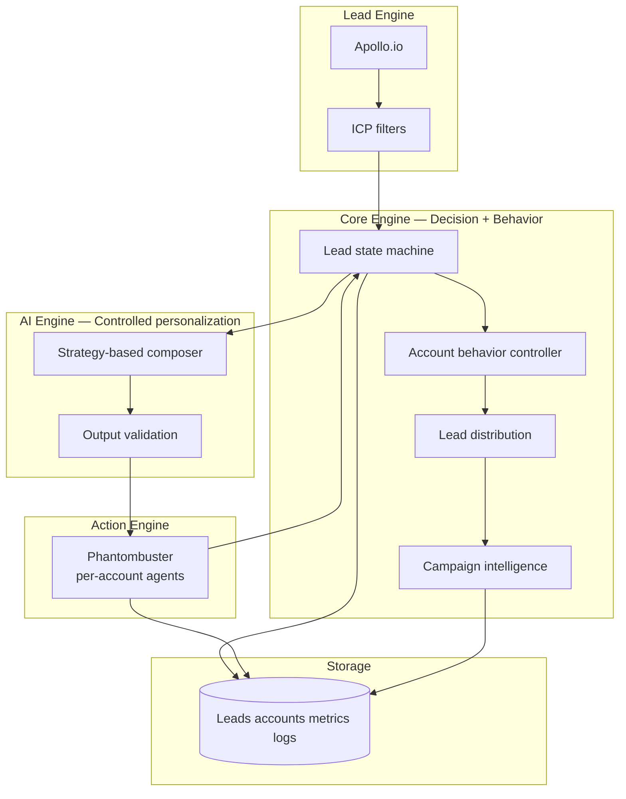
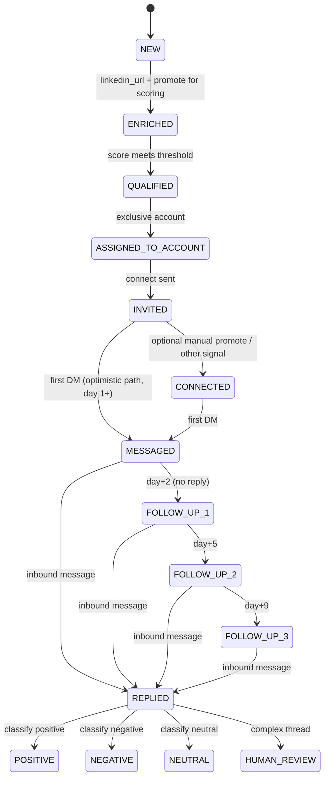
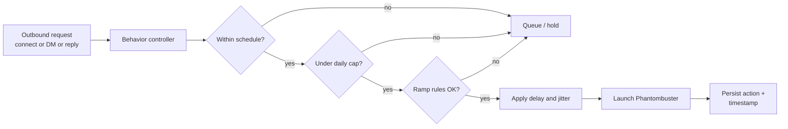

# PRD — LinkedIn Multi-Account Lead Generation & Outreach System (Production Ready)

| Field | Value |
|--------|--------|
| **Document** | Product Requirements Document |
| **Version** | 2.0 |
| **Last updated** | April 2026 (includes operations manual) |
| **Audience** | Client delivery, engineering, operations |

---

## Operations manual — LinkedIn automation agency (production)

This section describes the **as-built, production-ready** system for operators and client delivery. It complements the PRD sections below (requirements and deep design).

### OM-1. System overview

The platform is an **autonomous, multi-account LinkedIn lead-generation and engagement engine** designed to run **24/7 on a server** with bounded concurrency, per-identity limits, and durable state in SQLite.

| Layer | Technology |
|--------|------------|
| **Core engine** | Python 3 — orchestration, scoring, state machine, repository, daily automation |
| **AI messaging** | Python — strategy-based composers + validation (`core/ai_engine.py`, `core/strategy_engine.py`) |
| **Automation & outbound** | Python — Phantombuster client, engagement runner, behavior controller |
| **API & dashboard** | **FastAPI** (`dashboard_app/main.py`) — REST + optional static SPA |
| **Persistence** | **SQLite** — `leads`, `accounts_meta`, `action_log`, `metrics_daily`, … |
| **Operator UI** | **React + Vite** (`frontend/`) — hash routes (`/#/`, `/#/leads`, …) |

High-level flow: **discover / import leads → score → qualify → assign to accounts → connect / DM / follow-ups** with logs and metrics suitable for agency reporting.

### OM-2. Core features and safety mechanisms

#### Multi-account rotation and exclusivity

Qualified leads with no `account_id` are distributed by **`distribute_qualified_leads`** in [`core/repository.py`](core/repository.py): rows are selected in **score / creation order**, then assigned **round-robin** across `config/accounts.json` (`accounts[i % n].account_id`). Each lead receives **exactly one** `account_id` and transitions to **`ASSIGNED_TO_ACCOUNT`**. That **prevents the same lead from being claimed by two identities**, which avoids duplicate outreach from parallel accounts. If you remove an account from JSON, existing rows still tied to that old `account_id` are not auto-migrated; reassign them in SQLite (or clear `account_id` and set status back to `QUALIFIED`) so engagement picks them up again.

#### Behavior controller (“anti-ban” guardrails)

[`core/behavior_controller.py`](core/behavior_controller.py) gates every outbound **connect / DM / reply** via `approve_action`:

| Control | Source | Behavior |
|---------|--------|----------|
| **Working hours** | Per-account `schedule_start` / `schedule_end` in [`config/accounts.json`](config/accounts.example.json) | Actions only allowed inside the window (minute resolution). |
| **Weekends** | `weekend_actions` per account | If `false`, **no** outbound on Sat/Sun for that account. |
| **Clock** | Server `datetime.now().astimezone()` | Uses the **host OS timezone** (not hard-coded IST). Set Linux `TZ` (e.g. `Asia/Kolkata`) on the VPS for IST-aligned windows. |
| **Daily caps** | `steady_daily_limits` + ramp (`first_action_date`) + **hard caps** (`HARD_CAP_*` in `.env`) | Effective cap is the tighter of steady, ramp, and global hard caps. |
| **Burst smoothing** | `BURST_WINDOW_MINUTES`, `BURST_MAX_ACTIONS` | Limits rapid-fire actions per account. |
| **Inter-action delay** | `delay_range_sec` per account | Random sleep between actions in [`core/engagement_runner.py`](core/engagement_runner.py). |
| **Pause** | `accounts_meta.paused` | Stops automation for an identity until `--resume-account`. |

Together, these mimic **independent SDRs** rather than a single bulk bot.

#### AI-assisted messaging

Connection notes (and DM copy where applicable) are composed through the **strategy engine** and **AI engine**, then validated (e.g. length, repetition) before Phantombuster launch. Templates and strategy names (`direct`, `curiosity`, `value`, …) are configured per account.

#### Fault tolerance and deduplication

| Mechanism | Where | Purpose |
|-----------|--------|---------|
| **Single-instance lock** | [`core/daily_automation.py`](core/daily_automation.py) `_single_instance_lock` | Prevents overlapping **daily automation** runs (cron + manual double-start). |
| **PM2** | [`ecosystem.config.js`](ecosystem.config.js) | Process supervision for the **engagement** worker: `autorestart`, bounded `max_restarts`, `restart_delay`. |
| **SQLite `ON CONFLICT DO NOTHING`** | CSV import insert path [`core/repository.py`](core/repository.py) `insert_lead_csv_import` | Re-imports do not overwrite existing `lead_id` rows. |
| **Dedicated Phantombuster agents** | [`config/accounts.json`](config/accounts.example.json) + optional `STRICT_DISTINCT_PHANTOM_CONNECT_AGENTS` in `.env` | Each LinkedIn identity uses its own connect + DM phantom ids; strict mode aborts if connect or DM ids duplicate across accounts. |

### OM-3. Lead lifecycle (pipeline)

Statuses are enforced by [`core/state_machine.py`](core/state_machine.py). Primary **outbound** path:

```text
NEW → ENRICHED → QUALIFIED → ASSIGNED_TO_ACCOUNT → INVITED → CONNECTED → MESSAGED → FOLLOW_UP_1 → …
```

| Stage | Meaning |
|--------|---------|
| **NEW** | Ingested; may lack enrichment. |
| **ENRICHED** | LinkedIn URL present (and optional fields for scoring when available). |
| **QUALIFIED** | Meets score threshold; eligible for assignment. |
| **ASSIGNED_TO_ACCOUNT** | Bound to one `account_id` for outreach. |
| **INVITED** | Connect request sent (Phantombuster). |
| **CONNECTED** | Accept observed / promoted; eligible for first DM on schedule. |

Terminal / reply states (`REPLIED`, `POSITIVE`, `NEGATIVE`, …) and failures (`FAILED`) are documented in the state machine module.

### OM-4. Data sources (how to feed the engine)

#### Apollo.io (API)

Default pipeline uses **Apollo Web3 extraction** and related config (`APOLLO_*`, `DAILY_APOLLO_TARGET`, …). When **`APOLLO_EXTRACT_BULK_MATCH`** is enabled (default in code paths that call bulk match), Apollo **consumes credits** to hydrate LinkedIn URLs and emails—document this for finance / ops.

#### Apify CSV import (dashboard, no Apollo enrichment cost)

Operators can upload **cleaned Apify CSV exports** via the dashboard **Leads (SQLite)** page: **Choose CSV → Upload** → `POST /api/leads/import`.

- Rows are inserted as **`NEW`**, **`score = 0`**, with **`ON CONFLICT(lead_id) DO NOTHING`** so existing leads are never removed.
- Column headers vary by Apify actor; the synonym map lives in [`dashboard_app/apify_csv_import.py`](dashboard_app/apify_csv_import.py) (`_ALIASES`). Extend that map when a new export’s headers do not match.

After import, leads still need **scoring / qualification / assignment** (see OM-3) before engagement picks them up, unless your process promotes them through those steps.

### OM-5. Deployment and operations (Linux VPS, e.g. Hostinger)

Assume **Ubuntu**, repo cloned under e.g. `/var/www/leadgen`, **Python venv** from [`setup.sh`](setup.sh), secrets in **`.env`** and **`config/accounts.json`** (not committed).

#### Dashboard (FastAPI + built SPA)

| Action | Command / URL |
|--------|----------------|
| **Serve API + static UI** | `cd <repo> && python3 -m uvicorn dashboard_app.main:app --host 0.0.0.0 --port 8080` (production: use systemd or a reverse proxy + TLS). |
| **Open dashboard** | `http://<SERVER_IP>:8080/` (hash routes: `/#/leads`, …). Ensure **firewall / security group** allows TCP **8080** (or map behind nginx). |

Development alternative: `npm run dashboard:dev` (Vite + API proxy) — see §18.1.

#### PM2 — engagement worker

[`ecosystem.config.js`](ecosystem.config.js) defines process **`leadgen-engagement`** (`main.py --engagement-only --multi-account-run` using `./venv/bin/python`).

| Operator task | Command |
|-----------------|---------|
| **Stream logs** | `pm2 logs leadgen-engagement` |
| **Restart** | `pm2 restart leadgen-engagement` |
| **Status** | `pm2 status` |

#### Safe dry-run (daily pipeline without live Phantombuster engagement)

```bash
cd <repo> && source venv/bin/activate
python main.py --daily-automation --dry-run
```

Resolves engagement dry-run via [`config.resolve_engagement_dry_run`](config.py): **`--dry-run`** forces no PB launches for the engagement tail; **`--live`** overrides env `DRY_RUN` when intentional.

#### Scheduled daily automation (07:00)

The in-repo **default schedule time** for the long-running scheduler is **`DAILY_SCHEDULE_TIME`** (default **`07:00`**) when using:

```bash
python main.py --schedule
```

For a **VPS-style cron job** (recommended for predictable wake-ups without keeping `schedule` process alive), add a **crontab** entry, for example **07:00 local server time** daily:

```cron
0 7 * * * cd /var/www/leadgen && /var/www/leadgen/venv/bin/python main.py --daily-automation >> /var/www/leadgen/logs/cron_daily.log 2>&1
```

Adjust path, user, and logging directory. Load the same environment as manual runs (e.g. `Environment=` in systemd, or `set -a; source .env; set +a` in a wrapper script if not using systemd `EnvironmentFile`).

> **Note:** `ecosystem.config.js` currently runs **engagement-only**. The **full daily pipeline** (Apollo + merge + score + assign + engagement) is **`python main.py --daily-automation`** — wire **cron** or **separate PM2 app** for that if engagement PM2 alone is not sufficient for your agency workflow.

**Apify / dashboard-only leads (no Apollo merge file):** set `DAILY_SKIP_APOLLO=true` and `DAILY_SKIP_MERGED_CSV=true` so the run relies on leads already in SQLite (e.g. from `POST /api/leads/import`). Use `APIFY_IMPORT_FLOOR_SCORE` (same value as `MIN_SCORE_THRESHOLD` is typical) so dashboard imports can become `QUALIFIED` without full enrichment. **First DMs** do not require a separate “connections export” Phantombuster: after **`OPTIMISTIC_FIRST_DM_DAYS`**, the DM phantom may be sent while the lead is still **INVITED**; if the phantom output says not 1st degree / cannot message, the app logs `skipped` (`pb_not_connected_yet`), sets `next_dm_attempt_at` using **`DM_NOT_CONNECTED_COOLDOWN_DAYS`**, and retries later.

**Phantombuster “input already processed”:** when the connect/DM phantom skips a line (dedupe memory) but the container still finishes, the app logs connect dedupe as **`action_log.status=error`** with **`detail` prefixed by `connect_dedupe_skipped|pb_dedupe_already_processed`** (DM/follow-up dedupe still uses **`skipped`**). The lead is not promoted to **`INVITED`** unless **`DEDUPE_CONNECT_ASSUME_INVITED=true`** in `.env`. Otherwise **`CONNECT_DEDUPE_COOLDOWN_DAYS`** (default 7) sets **`next_dm_attempt_at`** so the connect queue moves on. Optional **`CONNECT_DEDUPE_FLAG_FAILED=true`** marks the lead **`FAILED`** for triage. Polling uses a **fast 3s interval** for the first few minutes, then 30s; if **`PHANTOM_ENGAGEMENT_TIMEOUT_MINUTES`** is exceeded without a terminal `status`, the app logs **`pb_polling_timeout`**. In the Phantombuster UI, set **file management to “Combine files”** (not “Delete previous files”) for stable dedupe, and use fresh lead URLs when possible.

#### Production: Phantombuster Ops

**Combine files**

In each Phantombuster agent’s file / spreadsheet settings, use **Combine files** (append) instead of **Delete previous files**. The latter wipes phantom-side input history and makes dedupe and debugging harder; combine mode keeps a stable stream for the same account while the app’s SQLite state remains the source of truth for lead progression.

**Duplicating agents (clear polluted memory)**

Phantombuster agents retain execution-side “memory” (e.g. lines already seen). If you see repeated false **`pb_dedupe_already_processed`** outcomes or a corrupted input sheet, **duplicate** the connect or Message Sender agent in the Phantombuster UI to obtain a **new agent id** with a clean slate. Then update that identity in **`config/accounts.json`**: set **`phantombuster_connect_agent_id`** and/or **`phantombuster_dm_agent_id`** to the new ids (see [`config/accounts.example.json`](config/accounts.example.json)). Restart the engagement worker (e.g. `pm2 restart leadgen-engagement`). You do not need to reset the SQLite database for this; only the Phantombuster launch target changes per account.

**Soft reset (SQL) — rewind stuck leads without wiping the database**

The app’s allowed status moves are defined in [`core/state_machine.py`](core/state_machine.py). For **one-off operator repairs**, use schema-aware `UPDATE` statements against **existing** columns only: run `PRAGMA table_info(leads);` on your database file (and `PRAGMA table_info(action_log);` if you touch logs) so you do not reference columns your build has not migrated yet. Work on a **copy** of the DB or a **backup** first.

| Symptom | Pattern |
|--------|---------|
| Lead stuck after **not 1st degree** / optimistic DM | Clear the retry clock so the runner can try again: `UPDATE leads SET next_dm_attempt_at = NULL, updated_at = ? WHERE lead_id = ?;` (use the same ISO timestamp style as elsewhere in the row). |
| Lead in a **bad terminal / wrong step** and you need to re-open | Move along allowed edges (e.g. to **`FAILED`**, then to **`QUALIFIED`** / **`ASSIGNED_TO_ACCOUNT`**) and fix **`account_id`** and timestamps as needed—never `DELETE` the whole `leads` table. |

Example **minimal unblock** (replace placeholders; confirm column names with `PRAGMA table_info(leads)`):

```sql
-- Single-lead retry after pb_not_connected_yet / cooldown
UPDATE leads
SET
  next_dm_attempt_at = NULL,
  updated_at = '2026-01-15T12:00:00+00:00'
WHERE lead_id = 'your-lead-id';
```

To **rewind** an outbound step that the in-app state machine does not allow reversing in one hop (e.g. you need to retry a first DM from an advanced state), use an intermediate state such as **`FAILED`** and then re-promote per [`core/repository.py`](core/repository.py) / your runbook, rather than bulk-deleting tables.

---

## 1. Executive summary

Build a **multi-account, low-risk** LinkedIn automation system that:

1. Generates **ICP-qualified** leads via **Apollo.io**
2. **Scores and segments** leads (connection/activity bonus points apply only when those fields exist in the DB; there is no separate Phantombuster profile-scraper step)
3. **Assigns** qualified leads to accounts
4. Executes **human-like** outreach across **multiple LinkedIn identities** (3–5 accounts) via Auto-Connect / Auto-DM phantoms
5. Uses **controlled AI-assisted** personalization (not fully autonomous AI)
6. **Tracks replies**, conversations, and outcomes for **campaign intelligence**

**Outbound messaging flow (implemented):** Connect (LLM + ≤200 char validation) → first DM when **`FOLLOW_UP_SCHEDULE["dm"]`** calendar day has elapsed (from `connected_at` or, for **INVITED** leads, optimistic timing from `invited_at` / `assigned_at` per the runner) → follow-up 1 / 2 / 3 on **`FOLLOW_UP_SCHEDULE`** (default from accept/invite: **1 / 2 / 5 / 9** calendar day offsets, i.e. **1 / 1 / 3 / 4** calendar day minimums after **connect → first DM → FU1 → FU2 → FU3** respectively). Inbound replies are **classified only** (`python main.py --ingest-reply …`); **no** LinkedIn auto-reply in this phase—humans respond.

Third-party outreach SaaS (e.g. Expandi, Waalaxy) and separate enrichment vendors (e.g. Clay) are **not required** in the target architecture: **Apollo** + **Phantombuster** + **first-party Core / AI / Storage** layers are sufficient when implemented to this spec.

### Core principle

The system must simulate **independent human SDRs**, not obvious bulk automation. Timing, limits, randomization, and per-account **strategies** are first-class requirements.

---

## 2. Success metrics (client-facing)

| Metric | Target |
|--------|--------|
| Leads / month | ≥ 1,000 |
| Connection accept rate | 20–40% |
| Reply rate | 5–15% |
| Positive replies | 2–8% |
| Account bans | **0** (hard success criterion; conservative defaults required) |

---

## 3. System architecture

**Logical layers**

```
Apollo          →  Lead Engine      (discovery, filters, lead_id assignment)
Phantombuster   →  Action Engine     (LinkedIn execution: connect, DM, inbox reads as designed)
Core Engine     →  Decision + Behavior Layer  (state machine, limits, scheduling, distribution)
AI Engine       →  Message Personalization    (variations, tone — validated, bounded)
Storage         →  State + Logs + Metrics     (durable lead state, message_history, aggregates)
```



---

## 4. Multi-account architecture (critical)

The system supports **3–5 LinkedIn accounts**. Each account is an **independent identity unit** with its own limits, schedule, strategy mix, template pool, and assigned lead subset.

### 4.1 Per-account configuration (required fields)

| Field | Description |
|--------|-------------|
| `account_id` | Stable internal identifier |
| `linkedin_profile` | Reference to profile / session mapping for Phantombuster |
| `daily_limits` | Connect / DM / reply caps (may follow ramp schedule) |
| `schedule_window` | Allowed local time window for actions (e.g. 09:00–11:00) |
| `message_strategy` | Primary strategy: `direct`, `curiosity`, `value`, `question`, `observation` |
| `template_pool` | Base templates + variables for non-AI fallback |
| `assigned_leads` | Partition of lead_ids exclusive to this account |
| `delay_range` | Random delay between actions (e.g. 30–180 seconds) |

### 4.2 Example mapping

| Account | Strategy (primary) | Daily limit (steady state) |
|---------|----------------------|----------------------------|
| A | `direct` | 20 |
| B | `curiosity` | 25 |
| C | `value-first` (`value`) | 15 |

**Rule:** No single strategy may be used by an account for **>50%** of messages in a rolling window; rotate using the strategy engine (Section 9).

---

## 5. Lead pipeline

### 5.1 Discovery (Apollo)

**Filters (minimum):**

- Title  
- Industry  
- Location  
- Company size  

**Standard output fields:**

| Field | Notes |
|--------|--------|
| `lead_id` | Stable UUID or deterministic hash (e.g. from Apollo id + source) |
| `name` | Full name |
| `company` | Company name |
| `title` | Job title |
| `linkedin_url` | Canonical normalized URL |

### 5.2 Enrichment (data available for scoring)

**Optional signals** (when present on the lead row, e.g. from Apollo or manual fields):

- Connection count  
- Activity flags (e.g. last-30-days)  
- Title, company, industry — used by [`core/lead_scorer.py`](core/lead_scorer.py)  

### 5.3 Scoring

| Signal | Points |
|--------|--------|
| Founder / CEO (incl. co-founder, owner) | +2 |
| Active on LinkedIn (policy-defined window) | +2 |
| 10+ years experience | +2 |
| 500+ connections | +1 |
| ICP match (segment / industry / title rules) | +2 |

**Qualification threshold:** score **≥ 6** (max 9 in this model).

---

## 6. Lead state machine

Leads transition only through **explicit, logged** events. Invalid transitions are rejected by the Core Engine.

**States**

`NEW` → `ENRICHED` → `QUALIFIED` → `ASSIGNED_TO_ACCOUNT` → `INVITED` → `CONNECTED` → `MESSAGED` → `FOLLOW_UP_1` → `FOLLOW_UP_2` → `FOLLOW_UP_3` → `REPLIED` → terminal: `POSITIVE` | `NEGATIVE` | `NEUTRAL` (and `COMPLEX` / `HUMAN_REVIEW` where applicable)



---

## 7. Account behavior controller (most important)

The behavior controller is the **safety and believability** layer. All outbound Phantombuster launches pass through it.

### 7.1 Responsibilities

- **Timing:** only within `schedule_window` per account  
- **Limits:** connect / DM / reply daily caps; ramp for new accounts  
- **Delays:** random inter-action delay within `delay_range`  
- **Sequence:** enforce invite → wait → DM → follow-ups per rules in Section 8  
- **Anti-burst:** no back-to-back maxed batches; jitter between batches  
- **Weekend / off-hours:** reduced or zero activity per config  

### 7.2 Scheduling rules (example)

| Account | Schedule window (local) |
|---------|-------------------------|
| A | 09:00–11:00 |
| B | 13:00–15:00 |
| C | 18:00–20:00 |

### 7.3 Daily limit ramp (example)

| Phase | Days | Max connects (example) |
|-------|------|-------------------------|
| Warm-up | 1–3 | 10 |
| Ramp | 4–7 | 20 |
| Steady | 8+ | 30–40 (never exceed product hard caps) |

### 7.4 Randomization (required)

- Delay between actions: **30–180 seconds** (configurable per account)  
- **Randomized action order** within allowed types for the tick (where safe)  
- **Random batch sizes** within min/max per account  



---

## 8. Outreach logic

### 8.1 Connection

**Trigger**

- `status == QUALIFIED` or `ASSIGNED_TO_ACCOUNT` (per implementation)  
- `score ≥ threshold`  
- Lead **never contacted** by any account (`last_action_at` / outreach log)  
- Account behavior controller **approves**  

### 8.2 DM (first message)

**Trigger**

- `status == CONNECTED`  
- **24–72 hours** elapsed since connect (configurable per campaign)  
- Controller approves DM cap  

### 8.3 Follow-up

| Milestone | Action |
|-----------|--------|
| Day 3 | Follow-up 1 (if no reply) |
| Day 7 | Follow-up 2 (if still no reply) |
| After 2 follow-ups | Stop automated sequence; optional human task |

---

## 9. Message strategy engine (critical upgrade)

This is **not** “templates only.” Strategies drive **structure and intent**; templates and AI supply **variation** under constraints.

### 9.1 Strategy types

| Strategy | Intent (summary) |
|----------|-------------------|
| `direct` | Clear, respectful reason to connect |
| `curiosity` | Open loop without hard pitch |
| `value` | Insight or resource angle |
| `question` | One focused question |
| `observation` | Specific signal from profile / company |

### 9.2 Per-account mapping

Each account has a **primary** strategy; the engine **rotates** so no account exceeds **50%** of sends on a single strategy in a rolling 14-day window (configurable).

### 9.3 Composition pipeline

1. Select strategy (rotation + A/B weights)  
2. Pull template **skeleton** + allowed variables  
3. Optional: **AI Engine** generates a **short variation** (Section 10)  
4. **Validation** gate (length, spam patterns, repetition vs recent sends)  
5. If validation fails → **regenerate once** with stricter prompt or fall back to safe template  

---

## 10. AI personalization engine (explicit definition)

**AI is not fully autonomous.** It operates only inside **bounded prompts** and **post-validation**.

### 10.1 Allowed AI usage

| Use case | AI role |
|----------|---------|
| Message body | Generate **variation** + tone adjustment from strategy + lead facts |
| Subject / first line | Same, with tighter length limits |
| Reply suggestion | **Draft only** for `complex` or operator queue — not auto-sent without policy |

### 10.2 Disallowed

- Autonomous multi-turn negotiation without caps  
- Sending without validation  
- Inventing facts not present in lead record or enrichment  

### 10.3 Controlled prompt example (reference)

```
Generate a LinkedIn DM in "curiosity" style for {first_name} at {company}.
Do NOT pitch a product.
Max 25 words.
Avoid repetitive openings used in the last 50 messages for this account.
```

### 10.4 Output validation (reject if)

- Exceeds max length (characters / words per channel)  
- Contains banned patterns (URLs count, spam triggers, “guarantee”, excessive `!`)  
- **Repetition:** n-gram overlap with recent messages for same `account_id` above threshold  
- Mentions unsupported claims (optional: fact whitelist check)  

---

## 11. Reply handling system

### 11.1 Classification

| Type | Description |
|------|-------------|
| `positive` | Interest, meeting intent, clear yes |
| `neutral` | Acknowledgment, low signal |
| `negative` | No, stop, not interested |
| `complex` | Legal, pricing, multi-thread — needs human |

### 11.2 Actions

| Type | Action |
|------|--------|
| Positive | **Human handoff** — no automated outbound; operator replies on LinkedIn |
| Neutral | Classify only; operator decides next step (no templated auto-send) |
| Negative | **Stop** all automation for this lead |
| Complex | **Human review** queue; no outbound auto-reply in this build |

### 11.3 Rule

Inbound handling is **classify + state update** only (`--ingest-reply`). Operators own all reply copy on LinkedIn.

---

## 12. Lead distribution system

Leads are **partitioned exclusively** across accounts.

**Example (900 leads, 2 accounts — e.g. `acc_a` and `acc_c`)**

| Account | Lead range (example partition) |
|---------|---------------------------------|
| A | Leads 1–450 |
| C | Leads 451–900 |

Each row in `config/accounts.json` is one LinkedIn identity: its own session cookie, connect phantom id, and DM phantom id. Engagement runs **accounts in file order** (A, then C, …); it does not reuse one phantom with another account’s cookie.

**Rule:** **No lead may be contacted by more than one account.** Enforce at `ASSIGNED_TO_ACCOUNT` with unique constraint on `lead_id` → `account_id` and global “any touch” guard.

---

## 13. Data storage (minimum schema)

| Field | Purpose |
|--------|---------|
| `lead_id` | Primary key |
| `linkedin_url` | Execution key |
| `account_id` | Owning identity |
| `status` | State machine value |
| `score` | Numeric + optional breakdown JSON |
| `message_history` | Append-only messages (outbound + inbound summaries) |
| `reply_type` | Last classification |
| `last_action_at` | For delays and follow-ups |
| `campaign_id` | Rollup reporting |

**Implementation note:** v1 may use SQLite or Postgres; CSV exports remain for RevOps backup.

---

## 14. Logging and metrics

**Counters (per account and global)**

- `connections_sent`  
- `connections_accepted`  
- `messages_sent`  
- `replies_received`  
- `positive_replies`  
- `errors` (by class: API, PB timeout, validation fail)  

**Campaign intelligence (required for improvement)**

- Performance **by message variant** (template id / AI seed / strategy)  
- Performance **by account**  
- Reply rates **by strategy**  
- Funnel conversion: INVITED → CONNECTED → MESSAGED → REPLIED  

---

## 15. Safety system

### 15.1 Hard limits (defaults — tune per client)

| Action | Hard daily cap (default) |
|--------|-------------------------|
| Connect | 40 |
| DM | 30 |
| Auto-reply | 20 |

Lower caps apply during ramp (Section 7.3). **Never** exceed hard limits even if user config asks for more.

### 15.2 Behavior simulation

- Actions only in **working hours** per `schedule_window`  
- **Weekend:** low or zero volume unless explicitly enabled  
- **No burst:** max actions per 15-minute sliding window (specify in implementation)  

---

## 16. Failure handling

| Situation | Behavior |
|-----------|----------|
| Transient error (API / PB) | Retry up to **3** times with exponential backoff |
| Permanent failure | Mark lead or batch **failed**; log reason; **skip and continue** |
| Account-level fault | Pause **that account only**; others continue |

---

## 17. Campaign intelligence

The system must answer, for each `campaign_id` and time range:

- Which **message / variant** performs best (reply rate, positive rate)  
- Which **account** performs best (same metrics)  
- Which **strategy** (`direct`, `curiosity`, etc.) converts best  

Outputs: **operations dashboard** (see below) + **exportable aggregates** (CSV/JSON) for client reviews.

---

## 18. CLI commands (target interface)

| Command | Purpose |
|---------|---------|
| `--full-run` | Apollo discovery → promote ENRICHED → score → assign → queue |
| `--daily-automation` | Pipeline: optional Apollo (`DAILY_SKIP_APOLLO`) → optional merged CSV import (`DAILY_SKIP_MERGED_CSV`) → score → assign → engagement (`DAILY_*` / `APIFY_IMPORT_FLOOR_SCORE`; use with cron or `--schedule`) |
| `--engagement-only` | Behavior controller + Phantombuster actions from current state |
| `--multi-account-run` | Engagement across all configured accounts in one supervised run |
| `--dry-run` | Plan actions; no PB launch (overrides env `DRY_RUN`) |
| `--live` | Force live PB for this run even if `DRY_RUN=true` in `.env` |
| `--max-leads N` | Engagement: cap leads processed per account per pass (default `ENGAGEMENT_MAX_LEADS_PER_ACCOUNT`) |
| `--resume` | Continue from last checkpoint without duplicating sends |
| `--ingest-reply LEAD_ID TEXT` | Append inbound message, classify (OpenRouter + regex fallback), set terminal status; **does not** send outbound LinkedIn traffic |

*(Current repository CLI may differ; align implementation to this table.)*

---

## 18.1 Operations dashboard (leads + Phantombuster)

Read-only UI over SQLite (`leads`, `action_log`, `metrics_daily`, …) plus a **CSV leads** tab for `output/leads_lookup_merged.csv` / `output/apollo_leads.csv` (Web3-only exports are not in the DB until you run the main pipeline or import them).

**Dependencies:** `pip install -r requirements.txt` (includes FastAPI + uvicorn). Frontend: `cd frontend && npm install`.

**Development (recommended — one command):** from the **repo root**, install the repo dev helper once, then start API + UI together (Vite proxies `/api` → `http://127.0.0.1:8080`; the API must be up or you will see `ECONNREFUSED` in the terminal):

```bash
npm install
npm run dashboard:dev
```

Then open `http://localhost:5173/` (or the URL Vite prints).

**Alternative:** shell script from repo root: `bash scripts/dev_dashboard.sh`

**Manual (two terminals):** if you only run `npm run dev` inside `frontend/` without anything on port **8080**, proxy calls fail — start the API first: `python3 -m uvicorn dashboard_app.main:app --reload --host 127.0.0.1 --port 8080`, then in another terminal `cd frontend && npm run dev`.

**Production-style (single port):** build the SPA, then serve it from the same process:

```bash
cd frontend && npm run build
cd .. && python3 -m uvicorn dashboard_app.main:app --host 127.0.0.1 --port 8080
```

Open `http://127.0.0.1:8080/` — the app uses **hash routing** (`/#/`, `/#/leads`, …). API docs: `http://127.0.0.1:8080/docs`.

**Auth:** If you set `DASHBOARD_API_TOKEN` in `.env`, every `/api/*` request must send `Authorization: Bearer <token>`. For the Vite dev server, set `VITE_DASHBOARD_TOKEN` in `frontend/.env` (see `frontend/.env.example`).

**Apify CSV import:** On the **Leads (SQLite)** page, use **Choose CSV → Upload** to call `POST /api/leads/import`. Rows are inserted as `NEW` with score `0`; duplicate `lead_id` values are skipped. Apify actors use different CSV headers (`url` vs `profileUrl` vs `linkedin_url`, etc.). If imports look empty or wrong, open your CSV header row and extend the alias map in [`dashboard_app/apify_csv_import.py`](dashboard_app/apify_csv_import.py) (`_ALIASES`).

**Data note:** Connect/DM counts and Phantombuster outcomes come from **`action_log`** and **`metrics_daily`**, populated when you run `python main.py --engagement-only` (use `--dry-run` to log planned connects without launching agents).

### Production-ready lead records (LinkedIn, email, assignment)

Apollo **People API Search** (`api_search`) returns **partial rows** by design: you often do **not** get a public LinkedIn URL or email until you call **`people/bulk_match`**, which uses Apollo **credits** but is what makes rows usable for this repo.

- **`APOLLO_EXTRACT_BULK_MATCH`** defaults to **`true`** in [`integrations/apollo_client.py`](integrations/apollo_client.py): each page of search results is enriched so **`linkedin_url`** and **`email`** (when Apollo exposes them) are written to SQLite via [`core/repository.py`](core/repository.py). Set `APOLLO_EXTRACT_BULK_MATCH=false` in `.env` only if you want to save credits and accept incomplete rows.
- **Scoring + assignment:** only **`QUALIFIED`** leads get **`account_id`** from [`distribute_qualified_leads`](core/repository.py). That requires scores above **`MIN_SCORE_THRESHOLD`** (see [`core/lead_scorer.py`](core/lead_scorer.py)). Leads that have a LinkedIn URL from Apollo are promoted **`NEW` → `ENRICHED`** so scoring can run; leads with **no** URL stay **`NEW`** and cannot be used for LinkedIn automation.

Re-run the pipeline after changing env flags so the DB is repopulated: `python main.py --target …`.

### 18.2 Strict outreach CSV (ICP export)

Web3 discovery writes [`output/apollo_leads.csv`](output/apollo_leads.csv) via [`lead_extraction/pipeline.py`](lead_extraction/pipeline.py) (`python main.py --apollo-web3 --target N`). That command **already paginates** Apollo until either **`N` rows pass the configured gates** or **`APOLLO_WEB3_MAX_PAGES`** / result exhaustion — same loop as today; partial stubs are still enriched with **`people/bulk_match`** as in §18.1 above.

Two gate layers exist:

1. **Stub ICP** ([`passes_strict_icp`](lead_extraction/post_filters.py)): Web3 signal, founder-level title, small company (legacy headcount band). Used on every `--apollo-web3` run.
2. **Strict outreach ICP** ([`lead_extraction/outreach_ready_filter.py`](lead_extraction/outreach_ready_filter.py)): industry rules, email hygiene, optional Apollo `email_status`, optional geography, optional **product-signal** (`ICP_OUTREACH_REQUIRE_PRODUCT_SIGNAL`), and tunable **company-name rejects** (`ICP_COMPANY_NAME_REJECT_SUBSTRINGS`).

**Optional:** set **`APOLLO_WEB3_STRICT_OUTREACH=true`** so rows appended toward `--target N` must also pass strict outreach (same rules as export). You may need more pages and credits to hit `N`. When unset (default), strict rules apply only at export time.

**Export:** from repo root, `python scripts/export_icp_outreach_csv.py` writes **`output/icp_outreach_ready.csv`** with eight columns (name, LinkedIn, email, title, company, size, industry, location) and logs per-reason reject counts.

**Cold email:** for production sends, set **`ICP_REQUIRE_APOLLO_EMAIL_STATUS=true`** and restrict **`ICP_APOLLO_EMAIL_STATUSES`** (e.g. `verified`) after a **fresh** `--apollo-web3` run so `email_status` exists on the CSV. See [`.env.example`](.env.example) for all `ICP_*` and `APOLLO_WEB3_*` knobs; tune **`ICP_COMPANY_NAME_REJECT_SUBSTRINGS`** if legitimate product names are filtered.

---

## 19. Configuration (environment and config files)

| Key | Purpose |
|-----|---------|
| `ACCOUNT_COUNT` | Number of active LinkedIn identities |
| `DAILY_LIMITS` | Per action type; may be JSON per account |
| `DELAY_RANGE` | e.g. `30-180` seconds |
| `MESSAGE_STRATEGY` | Default per account + rotation policy |
| `FOLLOW_UP_SCHEDULE` | JSON: day offsets from accept/optimistic start — `dm`, `followup_1`, `followup_2`, `followup_3` (default `{"dm":1,"followup_1":2,"followup_2":5,"followup_3":9}`); gaps for eligibility are derived in `config.follow_up_eligibility_gaps()` |
| `OPTIMISTIC_FIRST_DM_DAYS` | Minimum full calendar days before a first DM may be attempted for **INVITED** leads (default 1) |
| `DM_NOT_CONNECTED_COOLDOWN_DAYS` | When PB cannot message (not 1st degree), retry after this many full calendar days (`leads.next_dm_attempt_at`) |
| `HARD_CAP_CONNECT` / `HARD_CAP_DM` | Global daily ceilings vs `steady_daily_limits` in `config/accounts.json` (defaults 60 / 100) |
| `config/accounts.json` `profile_name` | Optional human label per identity (e.g. for logs / ops) |
| `PHANTOM_ENGAGEMENT_TIMEOUT_MINUTES` | Max wait when polling `fetch-result-object` for each connect/DM run (default 20) |
| `PHANTOMBUSTER_SERIALIZE_AGENT_LAUNCHES` | Default `true`: serialize launch+poll per Phantombuster agent id. `false` risks overlapping runs (unsupported for production stability) |
| `PHANTOMBUSTER_LOG_POLLING_DEBUG` | Log full per-poll JSON (sensitive; default false) |
| `DEDUPE_CONNECT_ASSUME_INVITED` | If true, connect dedupe also sets lead `INVITED` + `invited_at` for first-DM timing (risky) |
| `CONNECT_DEDUPE_COOLDOWN_DAYS` | After `connect_dedupe_skipped`, defer re-attempt via `next_dm_attempt_at` (default 7) |
| `CONNECT_DEDUPE_FLAG_FAILED` | If true, dedupe-skipped connects transition lead to `FAILED` (default false) |
| Apollo / Phantombuster keys | As in `.env.example` |

---

## 20. MVP scope (realistic)

**Must ship for client-ready MVP**

- Multi-account support (3–5)  
- Account behavior controller (schedule, limits, ramp, randomization)  
- Connect + first DM + follow-up schedule  
- Reply **classification** + bounded actions + human review path  
- Logging + **metrics** + basic **campaign intelligence** exports  
- Strategy engine + **AI variation** with **validation** (not templates-only)  

**Deferrable post-MVP**

- Full operator UI (edit/replay from UI — read-only dashboard exists; see §18.1)  
- Advanced A/B at message component level  
- Multi-channel (email) — out of scope unless added by amendment  

---

## 21. Final system goal

The client should perceive:

> “This behaves like **3–5 real SDRs** working **independently**, consistently **generating conversations** without **risking accounts**.”

Success is measured by **conversation quality and account safety**, not raw send volume.

---

## Appendix A — Repository vs PRD (implementation status)

| Capability | PRD (v2.0) | `leadgen` repo (current) |
|------------|------------|---------------------------|
| Apollo discovery | §5.1 | `integrations/apollo_client.py` |
| SQLite state + schema | §13 | `core/db.py`, `core/repository.py` |
| Multi-account config | §4 | `config/accounts.example.json` → `config/accounts.json` |
| Lead distribution | §12 | `core/repository.distribute_qualified_leads` |
| Behavior controller (schedule, ramp, burst, caps) | §7, §15 | `core/behavior_controller.py` |
| Strategy engine + templates | §9 | `core/strategy_engine.py` |
| AI variation + validation | §10 | `core/ai_engine.py` (optional `OPEN_ROUTER_API_KEY`) |
| Reply classification (keyword MVP) | §11 | `core/reply_handler.py` |
| Campaign intelligence export | §14, §17 | `core/metrics.py` |
| Connect + DM via PB | §8 | `core/engagement_runner.py`, `integrations/phantombuster_client.py` (argument shape must match your phantoms) |
| Full pipeline v2 | §1 | `core/pipeline.py`, default `python main.py` |
| CLI (§18) | §18 | `--engagement-only`, `--multi-account-run`, `--dry-run`, `--resume`, `--promote-connected`, `--intelligence-export`, `--ingest-reply` |
| Strict ICP outreach export | §18.2 | `lead_extraction/outreach_ready_filter.py`, `scripts/export_icp_outreach_csv.py`; optional `APOLLO_WEB3_STRICT_OUTREACH` in `lead_extraction/pipeline.py` |
| Follow-up sequence (gaps +1 / +3 / +4 from prior send; timeline 1 / 2 / 5 / 9) | §8.3 | `core/engagement_runner.py` — `FOLLOW_UP_SCHEDULE` / `follow_up_eligibility_gaps()`; states through `FOLLOW_UP_3` |
| Inbound classification (no auto-reply) | §11 | `core/repository.ingest_inbound_reply`, `core/reply_handler.classify_reply_auto`, `main.py --ingest-reply` |
| Legacy Clay / Expandi | Appendix B | `main.py --legacy-full` (optional) |

**Setup:** `cp config/accounts.example.json config/accounts.json` and set per-account Phantombuster agent ids (or global `PHANTOMBUSTER_*_AGENT_ID` in `.env`), `linkedin_profile` (session cookie), and optional `profile_name`. The optimistic **INVITED** first-DM path means you do not need a separate “connections list export” phantom; you may still run `python main.py --promote-connected <lead_id>` to mark a lead **CONNECTED** when you want that state in the database.

Engineering should keep this README as the **source of truth** for the human-only reply policy and engagement caps above.

---

## Appendix B — Legacy components

Optional legacy modules (`clay_client.py`, `outreach_client.py`) are **not part of this PRD**. Remove or isolate behind feature flags when implementing v2.0.
