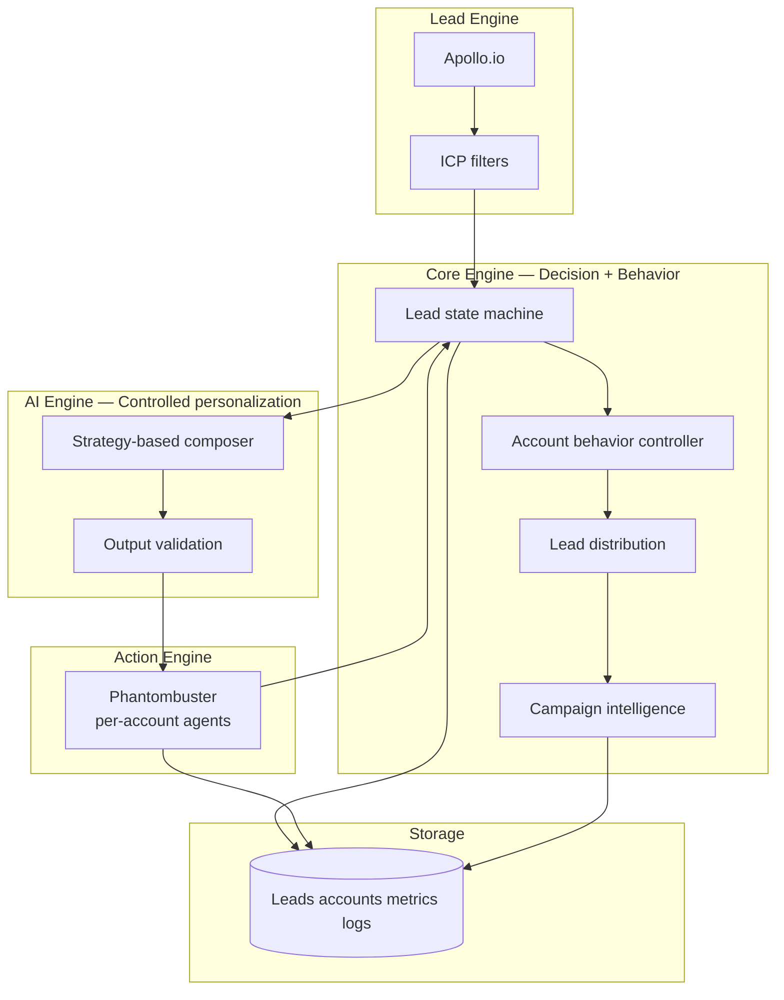
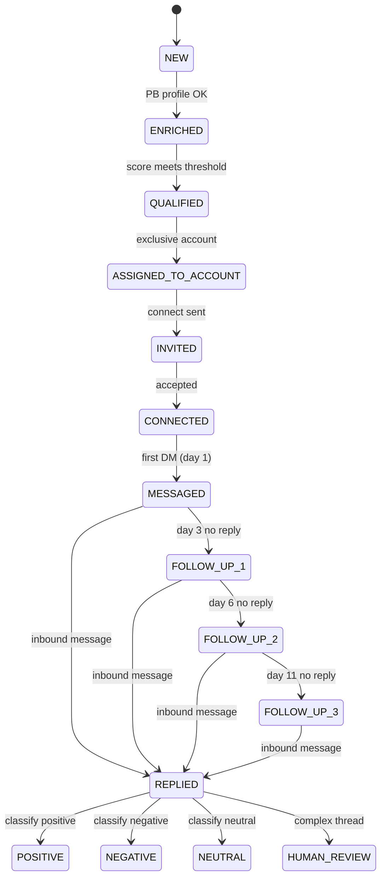
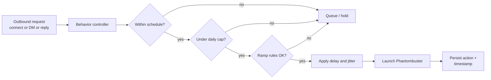

# PRD — LinkedIn Multi-Account Lead Generation & Outreach System (Production Ready)

| Field | Value |
|--------|--------|
| **Document** | Product Requirements Document |
| **Version** | 2.0 |
| **Last updated** | April 2026 |
| **Audience** | Client delivery, engineering, operations |

---

## 1. Executive summary

Build a **multi-account, low-risk** LinkedIn automation system that:

1. Generates **ICP-qualified** leads via **Apollo.io**
2. Enriches **LinkedIn signals** via **Phantombuster**
3. **Scores and segments** leads
4. Executes **human-like** outreach across **multiple LinkedIn identities** (3–5 accounts)
5. Uses **controlled AI-assisted** personalization (not fully autonomous AI)
6. **Tracks replies**, conversations, and outcomes for **campaign intelligence**

**Outbound messaging flow (implemented):** Connect (LLM + validation) → first DM on **day 1** after accept (≥ **`FOLLOW_UP_SCHEDULE["dm"]`** calendar day from `connected_at`) → follow-up 1 / 2 / 3 on timeline days **`followup_1` / `followup_2` / `followup_3`** from **`FOLLOW_UP_SCHEDULE`** (default **3 / 6 / 11** from connection, i.e. **2 / 3 / 5** calendar days after the prior outbound in the chain). Inbound replies are **classified only** (`python main.py --ingest-reply …`); **no** LinkedIn auto-reply in this phase—humans respond.

Third-party outreach SaaS (e.g. Expandi, Waalaxy) and separate enrichment vendors (e.g. Clay) are **not required** in the target architecture: **Apollo** + **Phantombuster** + **first-party Core / AI / Storage** layers are sufficient when implemented to this spec.

### Core principle

The system must simulate **independent human SDRs**, not obvious bulk automation. Timing, limits, randomization, and per-account **strategies** are first-class requirements.

---

## 2. Success metrics (client-facing)

| Metric | Target |
|--------|--------|
| Leads / month | ≥ 1,000 |
| Connection accept rate | 20–40% |
| Reply rate | 5–15% |
| Positive replies | 2–8% |
| Account bans | **0** (hard success criterion; conservative defaults required) |

---

## 3. System architecture

**Logical layers**

```
Apollo          →  Lead Engine      (discovery, filters, lead_id assignment)
Phantombuster   →  Action Engine     (LinkedIn execution: connect, DM, inbox reads as designed)
Core Engine     →  Decision + Behavior Layer  (state machine, limits, scheduling, distribution)
AI Engine       →  Message Personalization    (variations, tone — validated, bounded)
Storage         →  State + Logs + Metrics     (durable lead state, message_history, aggregates)
```



---

## 4. Multi-account architecture (critical)

The system supports **3–5 LinkedIn accounts**. Each account is an **independent identity unit** with its own limits, schedule, strategy mix, template pool, and assigned lead subset.

### 4.1 Per-account configuration (required fields)

| Field | Description |
|--------|-------------|
| `account_id` | Stable internal identifier |
| `linkedin_profile` | Reference to profile / session mapping for Phantombuster |
| `daily_limits` | Connect / DM / reply caps (may follow ramp schedule) |
| `schedule_window` | Allowed local time window for actions (e.g. 09:00–11:00) |
| `message_strategy` | Primary strategy: `direct`, `curiosity`, `value`, `question`, `observation` |
| `template_pool` | Base templates + variables for non-AI fallback |
| `assigned_leads` | Partition of lead_ids exclusive to this account |
| `delay_range` | Random delay between actions (e.g. 30–180 seconds) |

### 4.2 Example mapping

| Account | Strategy (primary) | Daily limit (steady state) |
|---------|----------------------|----------------------------|
| A | `direct` | 20 |
| B | `curiosity` | 25 |
| C | `value-first` (`value`) | 15 |

**Rule:** No single strategy may be used by an account for **>50%** of messages in a rolling window; rotate using the strategy engine (Section 9).

---

## 5. Lead pipeline

### 5.1 Discovery (Apollo)

**Filters (minimum):**

- Title  
- Industry  
- Location  
- Company size  

**Standard output fields:**

| Field | Notes |
|--------|--------|
| `lead_id` | Stable UUID or deterministic hash (e.g. from Apollo id + source) |
| `name` | Full name |
| `company` | Company name |
| `title` | Job title |
| `linkedin_url` | Canonical normalized URL |

### 5.2 Enrichment (Phantombuster)

**Extract (minimum):**

- Connection count  
- Activity (e.g. recent posts / activity window)  
- Profile strength / signals needed for scoring and messaging context  

### 5.3 Scoring

| Signal | Points |
|--------|--------|
| Founder / CEO (incl. co-founder, owner) | +2 |
| Active on LinkedIn (policy-defined window) | +2 |
| 10+ years experience | +2 |
| 500+ connections | +1 |
| ICP match (segment / industry / title rules) | +2 |

**Qualification threshold:** score **≥ 6** (max 9 in this model).

---

## 6. Lead state machine

Leads transition only through **explicit, logged** events. Invalid transitions are rejected by the Core Engine.

**States**

`NEW` → `ENRICHED` → `QUALIFIED` → `ASSIGNED_TO_ACCOUNT` → `INVITED` → `CONNECTED` → `MESSAGED` → `FOLLOW_UP_1` → `FOLLOW_UP_2` → `FOLLOW_UP_3` → `REPLIED` → terminal: `POSITIVE` | `NEGATIVE` | `NEUTRAL` (and `COMPLEX` / `HUMAN_REVIEW` where applicable)



---

## 7. Account behavior controller (most important)

The behavior controller is the **safety and believability** layer. All outbound Phantombuster launches pass through it.

### 7.1 Responsibilities

- **Timing:** only within `schedule_window` per account  
- **Limits:** connect / DM / reply daily caps; ramp for new accounts  
- **Delays:** random inter-action delay within `delay_range`  
- **Sequence:** enforce invite → wait → DM → follow-ups per rules in Section 8  
- **Anti-burst:** no back-to-back maxed batches; jitter between batches  
- **Weekend / off-hours:** reduced or zero activity per config  

### 7.2 Scheduling rules (example)

| Account | Schedule window (local) |
|---------|-------------------------|
| A | 09:00–11:00 |
| B | 13:00–15:00 |
| C | 18:00–20:00 |

### 7.3 Daily limit ramp (example)

| Phase | Days | Max connects (example) |
|-------|------|-------------------------|
| Warm-up | 1–3 | 10 |
| Ramp | 4–7 | 20 |
| Steady | 8+ | 30–40 (never exceed product hard caps) |

### 7.4 Randomization (required)

- Delay between actions: **30–180 seconds** (configurable per account)  
- **Randomized action order** within allowed types for the tick (where safe)  
- **Random batch sizes** within min/max per account  



---

## 8. Outreach logic

### 8.1 Connection

**Trigger**

- `status == QUALIFIED` or `ASSIGNED_TO_ACCOUNT` (per implementation)  
- `score ≥ threshold`  
- Lead **never contacted** by any account (`last_action_at` / outreach log)  
- Account behavior controller **approves**  

### 8.2 DM (first message)

**Trigger**

- `status == CONNECTED`  
- **24–72 hours** elapsed since connect (configurable per campaign)  
- Controller approves DM cap  

### 8.3 Follow-up

| Milestone | Action |
|-----------|--------|
| Day 3 | Follow-up 1 (if no reply) |
| Day 7 | Follow-up 2 (if still no reply) |
| After 2 follow-ups | Stop automated sequence; optional human task |

---

## 9. Message strategy engine (critical upgrade)

This is **not** “templates only.” Strategies drive **structure and intent**; templates and AI supply **variation** under constraints.

### 9.1 Strategy types

| Strategy | Intent (summary) |
|----------|-------------------|
| `direct` | Clear, respectful reason to connect |
| `curiosity` | Open loop without hard pitch |
| `value` | Insight or resource angle |
| `question` | One focused question |
| `observation` | Specific signal from profile / company |

### 9.2 Per-account mapping

Each account has a **primary** strategy; the engine **rotates** so no account exceeds **50%** of sends on a single strategy in a rolling 14-day window (configurable).

### 9.3 Composition pipeline

1. Select strategy (rotation + A/B weights)  
2. Pull template **skeleton** + allowed variables  
3. Optional: **AI Engine** generates a **short variation** (Section 10)  
4. **Validation** gate (length, spam patterns, repetition vs recent sends)  
5. If validation fails → **regenerate once** with stricter prompt or fall back to safe template  

---

## 10. AI personalization engine (explicit definition)

**AI is not fully autonomous.** It operates only inside **bounded prompts** and **post-validation**.

### 10.1 Allowed AI usage

| Use case | AI role |
|----------|---------|
| Message body | Generate **variation** + tone adjustment from strategy + lead facts |
| Subject / first line | Same, with tighter length limits |
| Reply suggestion | **Draft only** for `complex` or operator queue — not auto-sent without policy |

### 10.2 Disallowed

- Autonomous multi-turn negotiation without caps  
- Sending without validation  
- Inventing facts not present in lead record or enrichment  

### 10.3 Controlled prompt example (reference)

```
Generate a LinkedIn DM in "curiosity" style for {first_name} at {company}.
Do NOT pitch a product.
Max 25 words.
Avoid repetitive openings used in the last 50 messages for this account.
```

### 10.4 Output validation (reject if)

- Exceeds max length (characters / words per channel)  
- Contains banned patterns (URLs count, spam triggers, “guarantee”, excessive `!`)  
- **Repetition:** n-gram overlap with recent messages for same `account_id` above threshold  
- Mentions unsupported claims (optional: fact whitelist check)  

---

## 11. Reply handling system

### 11.1 Classification

| Type | Description |
|------|-------------|
| `positive` | Interest, meeting intent, clear yes |
| `neutral` | Acknowledgment, low signal |
| `negative` | No, stop, not interested |
| `complex` | Legal, pricing, multi-thread — needs human |

### 11.2 Actions

| Type | Action |
|------|--------|
| Positive | **Human handoff** — no automated outbound; operator replies on LinkedIn |
| Neutral | Classify only; operator decides next step (no templated auto-send) |
| Negative | **Stop** all automation for this lead |
| Complex | **Human review** queue; no outbound auto-reply in this build |

### 11.3 Rule

Inbound handling is **classify + state update** only (`--ingest-reply`). Operators own all reply copy on LinkedIn.

---

## 12. Lead distribution system

Leads are **partitioned exclusively** across accounts.

**Example (900 leads, 2 accounts — e.g. `acc_a` and `acc_c`)**

| Account | Lead range (example partition) |
|---------|---------------------------------|
| A | Leads 1–450 |
| C | Leads 451–900 |

Each row in `config/accounts.json` is one LinkedIn identity: its own session cookie, connect phantom id, and DM phantom id. Engagement runs **accounts in file order** (A, then C, …); it does not reuse one phantom with another account’s cookie.

**Rule:** **No lead may be contacted by more than one account.** Enforce at `ASSIGNED_TO_ACCOUNT` with unique constraint on `lead_id` → `account_id` and global “any touch” guard.

---

## 13. Data storage (minimum schema)

| Field | Purpose |
|--------|---------|
| `lead_id` | Primary key |
| `linkedin_url` | Execution key |
| `account_id` | Owning identity |
| `status` | State machine value |
| `score` | Numeric + optional breakdown JSON |
| `message_history` | Append-only messages (outbound + inbound summaries) |
| `reply_type` | Last classification |
| `last_action_at` | For delays and follow-ups |
| `campaign_id` | Rollup reporting |

**Implementation note:** v1 may use SQLite or Postgres; CSV exports remain for RevOps backup.

---

## 14. Logging and metrics

**Counters (per account and global)**

- `connections_sent`  
- `connections_accepted`  
- `messages_sent`  
- `replies_received`  
- `positive_replies`  
- `errors` (by class: API, PB timeout, validation fail)  

**Campaign intelligence (required for improvement)**

- Performance **by message variant** (template id / AI seed / strategy)  
- Performance **by account**  
- Reply rates **by strategy**  
- Funnel conversion: INVITED → CONNECTED → MESSAGED → REPLIED  

---

## 15. Safety system

### 15.1 Hard limits (defaults — tune per client)

| Action | Hard daily cap (default) |
|--------|-------------------------|
| Connect | 40 |
| DM | 30 |
| Auto-reply | 20 |

Lower caps apply during ramp (Section 7.3). **Never** exceed hard limits even if user config asks for more.

### 15.2 Behavior simulation

- Actions only in **working hours** per `schedule_window`  
- **Weekend:** low or zero volume unless explicitly enabled  
- **No burst:** max actions per 15-minute sliding window (specify in implementation)  

---

## 16. Failure handling

| Situation | Behavior |
|-----------|----------|
| Transient error (API / PB) | Retry up to **3** times with exponential backoff |
| Permanent failure | Mark lead or batch **failed**; log reason; **skip and continue** |
| Account-level fault | Pause **that account only**; others continue |

---

## 17. Campaign intelligence

The system must answer, for each `campaign_id` and time range:

- Which **message / variant** performs best (reply rate, positive rate)  
- Which **account** performs best (same metrics)  
- Which **strategy** (`direct`, `curiosity`, etc.) converts best  

Outputs: **operations dashboard** (see below) + **exportable aggregates** (CSV/JSON) for client reviews.

---

## 18. CLI commands (target interface)

| Command | Purpose |
|---------|---------|
| `--full-run` | Apollo discovery → enrichment → score → assign → queue |
| `--daily-automation` | Web3 Apollo scrape → merged CSV → SQLite import → capped PB profile enrich → score → assign → engagement (`DAILY_*` env; use with cron or `--schedule`) |
| `--engagement-only` | Behavior controller + Phantombuster actions from current state |
| `--multi-account-run` | Engagement across all configured accounts in one supervised run |
| `--dry-run` | Plan actions; no PB launch (overrides env `DRY_RUN`) |
| `--live` | Force live PB for this run even if `DRY_RUN=true` in `.env` |
| `--max-leads N` | Engagement: cap leads processed per account per pass (default `ENGAGEMENT_MAX_LEADS_PER_ACCOUNT`) |
| `--resume` | Continue from last checkpoint without duplicating sends |
| `--ingest-reply LEAD_ID TEXT` | Append inbound message, classify (OpenRouter + regex fallback), set terminal status; **does not** send outbound LinkedIn traffic |

*(Current repository CLI may differ; align implementation to this table.)*

---

## 18.1 Operations dashboard (leads + Phantombuster)

Read-only UI over SQLite (`leads`, `action_log`, `metrics_daily`, …) plus a **CSV leads** tab for `output/leads_lookup_merged.csv` / `output/apollo_leads.csv` (Web3-only exports are not in the DB until you run the main pipeline or import them).

**Dependencies:** `pip install -r requirements.txt` (includes FastAPI + uvicorn). Frontend: `cd frontend && npm install`.

**Development (recommended — one command):** from the **repo root**, install the repo dev helper once, then start API + UI together (Vite proxies `/api` → `http://127.0.0.1:8080`; the API must be up or you will see `ECONNREFUSED` in the terminal):

```bash
npm install
npm run dashboard:dev
```

Then open `http://localhost:5173/` (or the URL Vite prints).

**Alternative:** shell script from repo root: `bash scripts/dev_dashboard.sh`

**Manual (two terminals):** if you only run `npm run dev` inside `frontend/` without anything on port **8080**, proxy calls fail — start the API first: `python3 -m uvicorn dashboard_app.main:app --reload --host 127.0.0.1 --port 8080`, then in another terminal `cd frontend && npm run dev`.

**Production-style (single port):** build the SPA, then serve it from the same process:

```bash
cd frontend && npm run build
cd .. && python3 -m uvicorn dashboard_app.main:app --host 127.0.0.1 --port 8080
```

Open `http://127.0.0.1:8080/` — the app uses **hash routing** (`/#/`, `/#/leads`, …). API docs: `http://127.0.0.1:8080/docs`.

**Auth:** If you set `DASHBOARD_API_TOKEN` in `.env`, every `/api/*` request must send `Authorization: Bearer <token>`. For the Vite dev server, set `VITE_DASHBOARD_TOKEN` in `frontend/.env` (see `frontend/.env.example`).

**Data note:** Connect/DM counts and Phantombuster outcomes come from **`action_log`** and **`metrics_daily`**, populated when you run `python main.py --engagement-only` (use `--dry-run` to log planned connects without launching agents).

### Production-ready lead records (LinkedIn, email, assignment)

Apollo **People API Search** (`api_search`) returns **partial rows** by design: you often do **not** get a public LinkedIn URL or email until you call **`people/bulk_match`**, which uses Apollo **credits** but is what makes rows usable for this repo.

- **`APOLLO_EXTRACT_BULK_MATCH`** defaults to **`true`** in [`integrations/apollo_client.py`](integrations/apollo_client.py): each page of search results is enriched so **`linkedin_url`** and **`email`** (when Apollo exposes them) are written to SQLite via [`core/repository.py`](core/repository.py). Set `APOLLO_EXTRACT_BULK_MATCH=false` in `.env` only if you want to save credits and accept incomplete rows.
- **Phantombuster** profile enrichment ([`integrations/phantombuster_client.py`](integrations/phantombuster_client.py)) still requires a **non-empty LinkedIn URL** on the lead. Do **not** use `--skip-enrichment` on a full production run if you want connection counts and activity signals for scoring.
- **Scoring + assignment:** only **`QUALIFIED`** leads get **`account_id`** from [`distribute_qualified_leads`](core/repository.py). That requires scores above **`MIN_SCORE_THRESHOLD`** after enrichment (see [`core/lead_scorer.py`](core/lead_scorer.py)). If you skipped enrichment, leads that already have a LinkedIn URL from Apollo are promoted to **`ENRICHED`** so scoring can still run; leads with **no** URL stay **`NEW`** and cannot be used for LinkedIn automation.

Re-run the pipeline after changing env flags so the DB is repopulated: `python main.py --target …` (omit `--skip-enrichment` for the full path).

### 18.2 Strict outreach CSV (ICP export)

Web3 discovery writes [`output/apollo_leads.csv`](output/apollo_leads.csv) via [`lead_extraction/pipeline.py`](lead_extraction/pipeline.py) (`python main.py --apollo-web3 --target N`). That command **already paginates** Apollo until either **`N` rows pass the configured gates** or **`APOLLO_WEB3_MAX_PAGES`** / result exhaustion — same loop as today; partial stubs are still enriched with **`people/bulk_match`** as in §18.1 above.

Two gate layers exist:

1. **Stub ICP** ([`passes_strict_icp`](lead_extraction/post_filters.py)): Web3 signal, founder-level title, small company (legacy headcount band). Used on every `--apollo-web3` run.
2. **Strict outreach ICP** ([`lead_extraction/outreach_ready_filter.py`](lead_extraction/outreach_ready_filter.py)): industry rules, email hygiene, optional Apollo `email_status`, optional geography, optional **product-signal** (`ICP_OUTREACH_REQUIRE_PRODUCT_SIGNAL`), and tunable **company-name rejects** (`ICP_COMPANY_NAME_REJECT_SUBSTRINGS`).

**Optional:** set **`APOLLO_WEB3_STRICT_OUTREACH=true`** so rows appended toward `--target N` must also pass strict outreach (same rules as export). You may need more pages and credits to hit `N`. When unset (default), strict rules apply only at export time.

**Export:** from repo root, `python scripts/export_icp_outreach_csv.py` writes **`output/icp_outreach_ready.csv`** with eight columns (name, LinkedIn, email, title, company, size, industry, location) and logs per-reason reject counts.

**Cold email:** for production sends, set **`ICP_REQUIRE_APOLLO_EMAIL_STATUS=true`** and restrict **`ICP_APOLLO_EMAIL_STATUSES`** (e.g. `verified`) after a **fresh** `--apollo-web3` run so `email_status` exists on the CSV. See [`.env.example`](.env.example) for all `ICP_*` and `APOLLO_WEB3_*` knobs; tune **`ICP_COMPANY_NAME_REJECT_SUBSTRINGS`** if legitimate product names are filtered.

---

## 19. Configuration (environment and config files)

| Key | Purpose |
|-----|---------|
| `ACCOUNT_COUNT` | Number of active LinkedIn identities |
| `DAILY_LIMITS` | Per action type; may be JSON per account |
| `DELAY_RANGE` | e.g. `30-180` seconds |
| `MESSAGE_STRATEGY` | Default per account + rotation policy |
| `FOLLOW_UP_SCHEDULE` | JSON object: timeline day offsets from connection, keys `dm`, `followup_1`, `followup_2`, `followup_3` (default `{"dm":1,"followup_1":3,"followup_2":6,"followup_3":11}`) |
| Apollo / Phantombuster keys | As in `.env.example` |

---

## 20. MVP scope (realistic)

**Must ship for client-ready MVP**

- Multi-account support (3–5)  
- Account behavior controller (schedule, limits, ramp, randomization)  
- Connect + first DM + follow-up schedule  
- Reply **classification** + bounded actions + human review path  
- Logging + **metrics** + basic **campaign intelligence** exports  
- Strategy engine + **AI variation** with **validation** (not templates-only)  

**Deferrable post-MVP**

- Full operator UI (edit/replay from UI — read-only dashboard exists; see §18.1)  
- Advanced A/B at message component level  
- Multi-channel (email) — out of scope unless added by amendment  

---

## 21. Final system goal

The client should perceive:

> “This behaves like **3–5 real SDRs** working **independently**, consistently **generating conversations** without **risking accounts**.”

Success is measured by **conversation quality and account safety**, not raw send volume.

---

## Appendix A — Repository vs PRD (implementation status)

| Capability | PRD (v2.0) | `leadgen` repo (current) |
|------------|------------|---------------------------|
| Apollo discovery | §5.1 | `integrations/apollo_client.py` |
| SQLite state + schema | §13 | `core/db.py`, `core/repository.py` |
| Multi-account config | §4 | `config/accounts.example.json` → `config/accounts.json` |
| Lead distribution | §12 | `core/repository.distribute_qualified_leads` |
| Behavior controller (schedule, ramp, burst, caps) | §7, §15 | `core/behavior_controller.py` |
| Strategy engine + templates | §9 | `core/strategy_engine.py` |
| AI variation + validation | §10 | `core/ai_engine.py` (optional `OPEN_ROUTER_API_KEY`) |
| Reply classification (keyword MVP) | §11 | `core/reply_handler.py` |
| Campaign intelligence export | §14, §17 | `core/metrics.py` |
| Phantombuster profile enrich | §5.2 | `integrations/phantombuster_client.py` |
| Connect + DM via PB | §8 | `core/engagement_runner.py` (argument shape must match your phantoms) |
| Full pipeline v2 | §1 | `core/pipeline.py`, default `python main.py` |
| CLI (§18) | §18 | `--engagement-only`, `--multi-account-run`, `--dry-run`, `--resume`, `--promote-connected`, `--intelligence-export`, `--ingest-reply` |
| Strict ICP outreach export | §18.2 | `lead_extraction/outreach_ready_filter.py`, `scripts/export_icp_outreach_csv.py`; optional `APOLLO_WEB3_STRICT_OUTREACH` in `lead_extraction/pipeline.py` |
| Follow-up sequence (days 3 / 6 / 11) | §8.3 | `core/engagement_runner.py` — `FOLLOW_UP_SCHEDULE` / `follow_up_eligibility_gaps()`; states through `FOLLOW_UP_3` |
| Inbound classification (no auto-reply) | §11 | `core/repository.ingest_inbound_reply`, `core/reply_handler.classify_reply_auto`, `main.py --ingest-reply` |
| Legacy Clay / Expandi | Appendix B | `main.py --legacy-full` (optional) |

**Setup:** `cp config/accounts.example.json config/accounts.json` and set per-account Phantombuster agent IDs (or global `PHANTOMBUSTER_*_AGENT_ID` in `.env`). After a connection is accepted in LinkedIn, run `python main.py --promote-connected <lead_id>` so first DM can fire per §8.2.

Engineering should keep this README as the **source of truth**; optional inbox **sync** phantoms can be added later without changing the human-only reply policy above.

---

## Appendix B — Legacy components

Optional legacy modules (`clay_client.py`, `outreach_client.py`) are **not part of this PRD**. Remove or isolate behind feature flags when implementing v2.0.
